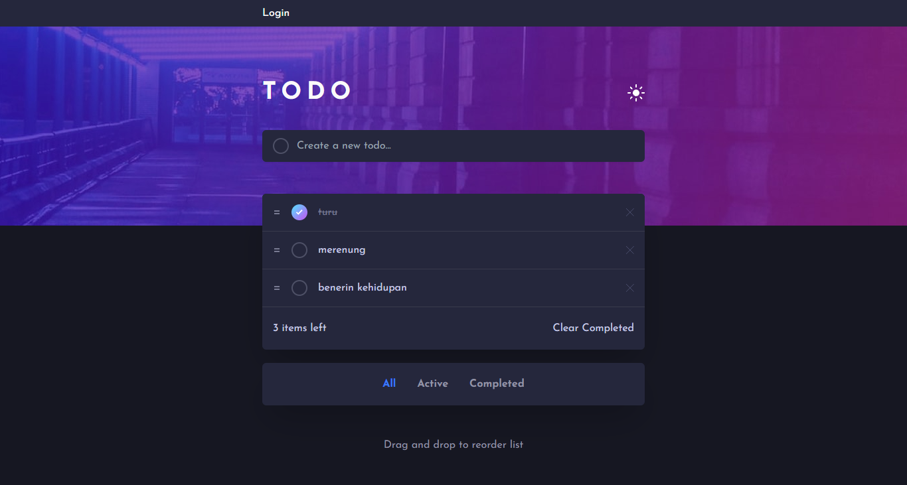

# Fullstack Todo App

<!-- screenshots here -->

A challenge from [frontendmentor.io](https://www.frontendmentor.io/)

## Overview

### Links

- [Live Site](https://your-live-site-url.com)
- [Solution](https://your-solution-url.com)

### The challenge

Users should be able to:

- View the optimal layout for the site depending on their device's screen size
- See hover states for all interactive elements on the page
- Create the background shape using code

## My process

### Built with

- Semantic HTML5 markup
- Tailwind CSS
- Mobile-first workflow
- React + Typescript
- Node JS

### What I learned

### Useful Resources

1. [Figma](https://www.figma.com/) - Paste your project design mockups to check the size, colors, etc.
2. [React Beautiful DnD](https://github.com/atlassian/react-beautiful-dnd) - Beautiful and accessible drag and drop for lists with React
3. [Vite](https://vitejs.dev/) - Fast react build tool
4. [Lama Dev](https://www.youtube.com/c/LamaDev) - That guy helps me to undertand how backend works (Express middleware, JWT, error handling)

## Acknowledgments

Thank you very much to everyone who gave me feedback on my solution. It greatly assists me in improving my frontend development skills.
